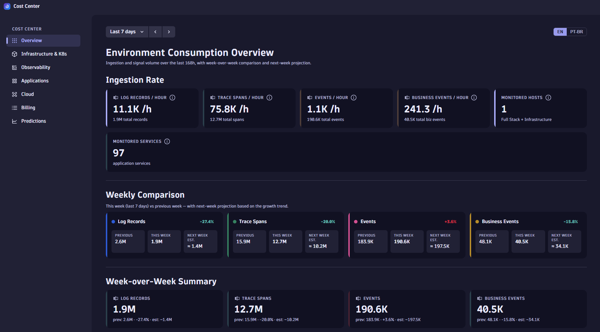
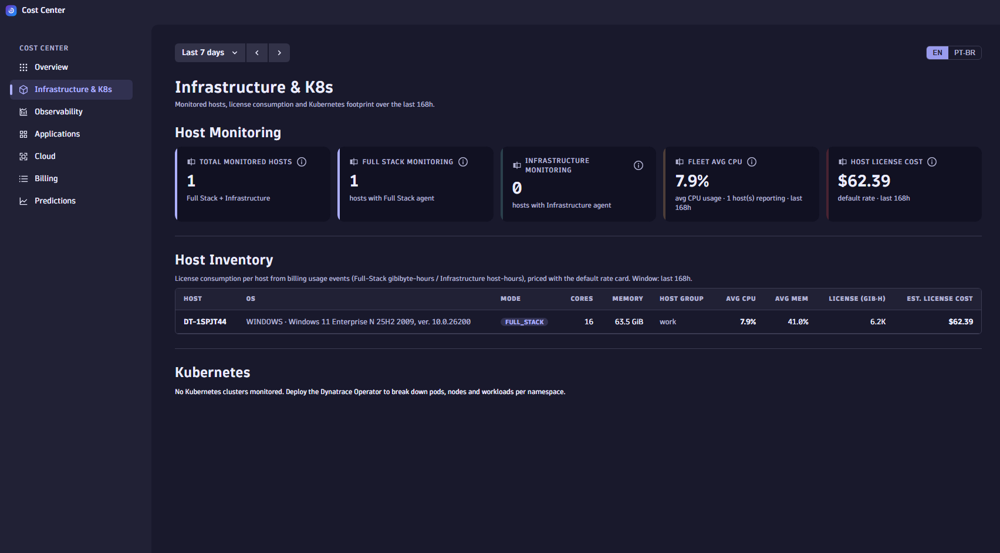
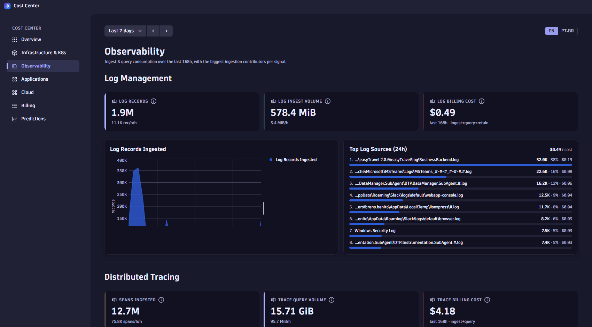
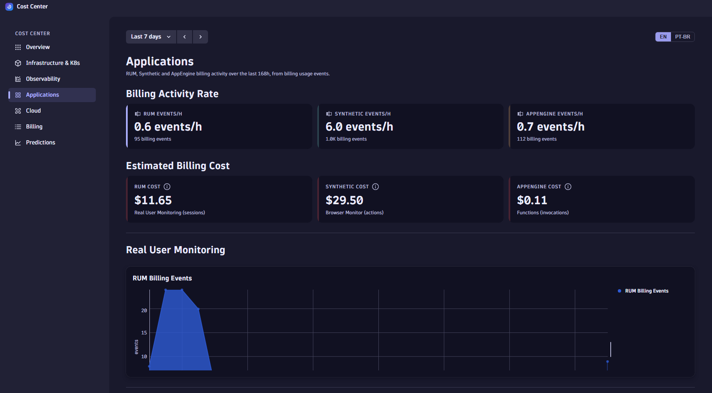
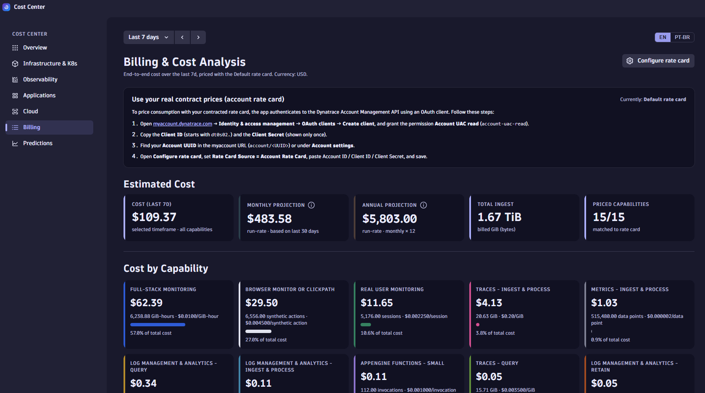
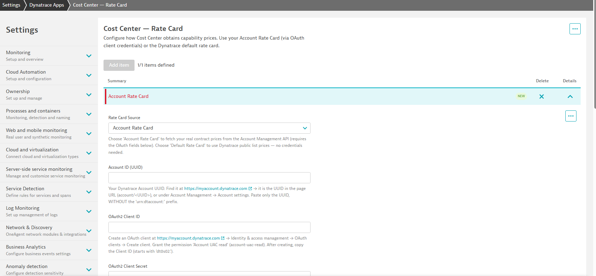

# Cost Center

A Dynatrace **AppEngine** app that gives an executive, end-to-end view of an environment's
**consumption and cost** — priced with the account's real **contract rate card**, cross-checked
against Dynatrace's own **official billing**, and broken down to a granularity the billing API
does not expose (per capability, host, namespace, workload and offender).

Built with React + the Dynatrace **Strato** design system. Bilingual (EN / PT-BR) explanations.

---

## What it does

- Reconstructs cost from Dynatrace's own metering (`BILLING_USAGE_EVENT`) × the account rate card.
- Reads the **authoritative Dynatrace Official Cost per capability** (Platform Subscription API) and **calibrates every estimate in the app against it**, so all tabs speak the same numbers as Account Management.
- Stable **monthly / annual run-rate projections** (fixed 30-day basis — they don't drift when you change the viewing window) and **budget vs. annual commitment**.
- Per-capability cost, **biggest ingestion offenders**, per-host / per-node / per-namespace / per-workload attribution.
- **Cost allocation** by cost center and product (`dt.cost.*` tags), with coverage detection.
- **Query cost attribution** — which dashboard, user and app is burning the Grail query budget, plus detection of queries re-run mechanically.
- Native Dynatrace **timeframe picker**, automatic currency from the contract (e.g. BRL), and an **EN / PT-BR** toggle for the explanatory text.

---

## Tabs

| Tab | What you see |
|-----|--------------|
| **Overview** | Ingestion rates (logs, spans, events, bizevents / hour), monitored hosts & services, week-over-week trend |
| **Infrastructure & K8s** | Hosts by mode (Full-Stack / Infrastructure), per-host license cost, Kubernetes (clusters/nodes/pods/workloads/namespaces) with **per-node**, **per-namespace** and **top-workload** cost |
| **Observability** | Logs, traces, events, bizevents — volumes, rates and billing cost, with biggest ingestion offenders |
| **Applications** | RUM (sessions), Synthetic (actions), AppEngine (invocations), tracing cost |
| **Cloud** | Direct cloud integration (CloudWatch / Azure Monitor / GCP) footprint and **cloud-service metric (DDU) cost** — host cost stays in Infrastructure to avoid double counting |
| **Billing** | End-to-end cost per capability × rate card, Estimated Cost KPIs, **Dynatrace Official Cost**, budget vs. commitment, run-rate projections, CSV export |
| **Cost Allocation** | Cost per **cost center** and per **product**, read from the `dt.cost.*` tags on billing events, with allocation-coverage detection |
| **Query Cost** | Grail query spend by **dashboard**, **user** and **app**, plus **recoverable waste** from byte-identical queries re-run mechanically |

> **Fixed window:** Billing, Cost Allocation and Query Cost hide the timeframe picker — they are pinned to the Account Management billing period so their figures can never drift from the official Cost & Usage view.

---

## App tour

> Screenshots live in [`docs/screenshots/`](docs/screenshots). EN/PT-BR toggle and the native timeframe picker are in the top bar of every tab.

### Overview — *where consumption is heading*

At-a-glance ingestion rates (log records, trace spans, events, business events per hour), monitored hosts and services, plus a **week-over-week comparison** with a next-week projection. Purpose: spot consumption trends and growth direction before they hit the bill.

### Infrastructure & K8s — *where host & Kubernetes spend goes*

Hosts by monitoring mode (Full-Stack / Infrastructure), a **per-host inventory** with license consumption (GiB-hours) and estimated cost, and the full Kubernetes breakdown — clusters, nodes, pods, workloads, namespaces — with **per-node, per-namespace and top-workload cost**. Purpose: attribute infrastructure license spend down to the host, node and namespace.

### Observability — *what drives ingest cost*

Logs, traces and events: volumes, per-hour rates and billing cost, each with the **biggest ingestion contributors** (top log sources, span operations). Purpose: pinpoint the sources inflating ingest so they can be tuned.

### Applications — *digital-experience monitoring cost*

RUM (sessions), Synthetic (browser-monitor actions) and AppEngine (function invocations): billing activity rate and **estimated cost per capability**. Purpose: see what front-end and synthetic monitoring costs.

### Billing — *the consolidated source of truth*

End-to-end **cost by capability** (consumption × rate card), Estimated Cost KPIs, run-rate projections, and the authoritative **Dynatrace Official Cost** (when the account rate card is configured). Purpose: the executive cost view, validated against Dynatrace's own billing.

### Cost Allocation — *who pays for what*
> Screenshot pending.

Cost broken down by **cost center** (who pays) and by **product** (what consumes), read from the `dt.cost.costcenter` / `dt.cost.product` attributes that Dynatrace attaches to billing usage events. Each team tile lists its cost per capability. The tab detects whether allocation is configured at all and, when it isn't, explains the two setup steps instead of showing an empty chart. Purpose: charge platform spend back to the teams that generate it.

> Cost Allocation is **not retroactive** — it applies from the moment tagging is configured forward.

### Query Cost — *who is burning the query budget*
> Screenshot pending.

Account Management reports Grail query spend as a single lump per capability. The billing usage events carry `user.email`, `client.application_context` and `client.source`, so this tab attributes that spend by **dashboard** (the id deep-links straight to the dashboard), **user** and **app**.

It also flags **recoverable waste**: queries that repeat with a byte-identical scan. A person writing DQL never reproduces a byte count to the digit — that pattern is an auto-refreshing dashboard tile or an automation loop re-running one costly query. Only the repeats beyond the first are counted, since that spend bought no new data. Purpose: find the handful of tiles responsible for most of the query bill.

### Settings — Rate Card — *load real contract prices*

Choose **Account Rate Card** (real contract prices via an OAuth client) or the **Default** list-price card. Purpose: price all consumption with the customer's actual contract so the figures match the invoice.

---

## Architecture

```
        ┌───────────────────────────────────────────────┐
        │              Cost Center — UI                  │
        │           React + Strato · 8 tabs              │
        └───────────────┬───────────────────┬───────────┘
                        │                   │
        DQL → Grail     │                   │   App Function (OAuth client-credentials)
        (queryExecute)  ▼                   ▼   — external, authenticated
   ┌────────────────────────────┐   ┌──────────────────────────────────┐
   │ dt.system.events           │   │ Account Management API            │
   │   BILLING_USAGE_EVENT      │   │   → contract rate card (BRL)      │
   │ dt.entity.* (hosts/K8s/…)  │   │ Platform Subscription / Cost API  │
   │ logs · spans · metrics     │   │   → official cost + period        │
   └─────────────┬──────────────┘   └─────────────────┬────────────────┘
                 └──────────────┬──────────────────────┘
                                ▼
                        ┌───────────────┐
                        │  Cost Engine  │  cost = quantity × price/unit
                        └───────┬───────┘
                                ▼
                        ┌───────────────┐
                        │  Calibration  │  × (official cost ÷ estimate), per capability
                        └───────┬───────┘
                                ▼
        KPIs · per-capability · offenders · projections · allocation · query cost
```

Two data channels:

1. **In-tenant (Grail) via DQL** — `queryExecutionClient.queryExecute` from the UI. No secrets, runs as the app's permissions.
2. **External via the App Function** — `api/get-rate-card.function.ts` runs server-side on AppEngine, authenticates with an OAuth client (`account-uac-read`), and calls the Account Management + Subscription APIs. External calls **cannot** be made from the browser, and the target hosts must be allow-listed (see Setup).

---

## How each component is captured

### 1. Billing / cost (the core)

Source of truth is **`fetch dt.system.events | filter event.kind == "BILLING_USAGE_EVENT"`** — these
events *are* Dynatrace's metering (they even carry `dt.cost.product` / `dt.cost.costcenter`). The
billing query (`billingDetailByTypeQuery`) sums, per `event.type`, the metered field for that capability.

The **Cost Engine** (`ui/app/utils/costEngine.ts`) maps each capability to a *unit* and multiplies
`quantity × rate-card price/unit`:

| Unit | Metered field | Capabilities |
|------|---------------|--------------|
| `gib_hours` | `billed_gibibyte_hours` | Full-Stack, Runtime Vulnerability |
| `host_hours` | `billed_host_hours` | Infrastructure |
| `pod_hours` | `billed_pod_hours` | Kubernetes Platform Monitoring |
| `gib` | `billed_bytes` + `ingested_bytes` | Logs/Traces/Events ingest & query |
| `gib_days` | `avg(billed_bytes) × days` | **Retain** (logs/events) |
| `datapoints` | `data_points` | Metrics |
| `requests` | `billed_http_request_count` | HTTP Monitor |
| `actions` | `billed_synthetic_action_count` | Browser Monitor / Clickpath |
| `sessions` | `billed_sessions` | Real User Monitoring |
| `invocations` | `billed_invocations` | AppEngine Functions |

> **Retain gotcha:** Retain events are periodic *snapshots* of the total retained volume, and the
> snapshot frequency varies per tenant (hourly vs every 30 min). Cost is billed in gibibyte-days, so
> it is computed as `avg(retained GiB) × days-in-window` — frequency-independent. Summing the snapshots
> over-counts ~30×.

### 2. Rate card (contract prices)

`get-rate-card.function.ts` → OAuth (`account-uac-read`) → `GET /sub/v1/accounts/{id}/rate-cards`.
Returns each capability's price per unit in the contract currency. Falls back to a built-in
**default rate card** (list prices, USD) when the account isn't configured. Capability matching is
tolerant (`normalizeCapabilityName`), with name-based overrides for Retain / HTTP Monitor / Kubernetes.

### 3. Dynatrace Official Cost — and app-wide calibration

Same function → `GET /sub/v2/accounts/{id}/subscriptions/{sub}/cost`, called **once per capability**
via the `capabilityKeys` filter. This is the authoritative amount Dynatrace bills, with the period
read from `startTime` / `endTime`.

Quantity × price alone never reconciles exactly — DPS applies contract allowances by licensing type
that the raw metered quantities can't express (traces landed ≈ 13% high before this). So
`useCostCalibration` derives a per-capability factor, `official cost ÷ estimated cost`, and every
other tab multiplies its estimate by it. The result: the granular attribution stays granular, but the
totals match Account Management instead of merely approaching it.

Because the official figures cover Dynatrace's billing period, the Billing / Cost Allocation / Query
Cost tabs pin their window to that same period (`useBillingPeriod`) and hide the timeframe picker.

### 3b. Cost allocation and query attribution

Both read the *same* `BILLING_USAGE_EVENT` stream, just grouped by attributes the billing API doesn't
surface:

| Tab | Attribute used | Note |
|-----|----------------|------|
| Cost Allocation | `dt.cost.costcenter` / `dt.cost.product` | Arrays of objects — `arrayFirst(...)[key]`, with null and the literal `"unassigned"` folded together |
| Query Cost | `user.email`, `client.application_context`, `ai_generated` | One event per executed query, so `count()` is the true query count |
| Query Cost (per dashboard) | `client.source` → `/ui/dashboard/<uuid>` | The URL host prefix is **per session**, so the uuid must be parsed out and grouped on — grouping by raw URL splits one offender into many |

### 4. Entities (hosts, Kubernetes, cloud)

`fetch dt.entity.host`, `dt.entity.kubernetes_node`, `dt.entity.cloud_application` (workloads),
`dt.entity.cloud_application_instance` (pods). Relationships: pod→workload via `instance_of`,
host→provider via the host's `cloudType` field, K8s node identified by name join.

### 5. Consumption (Observability / Overview)

`fetch logs / spans / bizevents` (counts) and `timeseries` over `builtin:billing.*` (volumes / rates).
Span counts come from `dt.system.events ingested_spans` (≈0 GB scan) instead of `fetch spans` (many GB).

---

## Cloud cost model

There is **no per-cloud-service billing SKU** in Dynatrace. Cloud monitoring cost has two parts:

1. **Cloud hosts** running OneAgent (EC2 / Azure VM / GCE) → billed as Full-Stack / Infrastructure.
   These live in **Infrastructure & K8s** only (showing them in Cloud would double-count).
2. **Cloud services** (RDS, Lambda, S3 …) monitored via CloudWatch / Azure Monitor / Google Cloud →
   no agent, billed by the **metric data points they ingest** (Davis Data Units,
   `builtin:billing.ddu.metrics.byEntity`, under "Metrics – Ingest & Process").

The **Cloud** tab represents the **direct integration** only — service-metric (DDU) consumption per
service, populating once an integration is connected.

---

## Cross-cutting mechanisms

- **Timeframe** — Strato's native `TimeframeSelector`; `from` / `to` are injected into every query (`dqlFrom` / `dqlTo`).
- **Currency** — `CurrencyContext` formats values in the rate card's native currency (no FX conversion).
- **i18n** — `LanguageContext` + `i18n/strings.ts`; the EN/PT-BR toggle switches **explanatory text only**. Capability names and units stay in English (they mirror Dynatrace's billing terms).
- **Run-rate projection** — monthly/annual use a fixed trailing-30-day basis, so they don't shift with the viewing window.
- **Calibration** — every cost figure outside Billing is multiplied by its capability's official/estimate factor, so no two tabs disagree.

### Keeping the app itself cheap

Cost Center bills like any other Grail consumer, so its own scan is treated as a feature:

- Almost everything reads **`dt.system.events` (~0 GB)** — log/span/event counts come from
  `BILLING_USAGE_EVENT` fields, not from `fetch logs` / `fetch spans`.
- The **top-offender panels** (Observability, Applications) are the only queries that scan raw data.
  They start **parked behind a "Load top contributors" button** — opening a tab costs nothing; the
  6h raw scan runs only when someone asks for the ranking.
- `useDql` keeps a module-level **query cache (10 min TTL, promise dedup)**, so identical DQL issued
  by several tabs executes once. It also takes an `enabled` flag, which is what gates the panels above.
- The Billing tab publishes an **estimate of what running the app costs**, priced from the Log Query rate.

> This wasn't theoretical: before gating, the app appeared in its own repeated-queries detector —
> its offender panels were re-running a 465 GiB scan on every tab open.

---

## Project structure

```
consumption-dashboard/
├── app.config.json            ← App manifest (committed: scopes, icon, plugins; set environmentUrl)
├── main.tsx                   ← AppEngine entry point
├── api/
│   └── get-rate-card.function.ts   ← App Function: OAuth → rate card + official cost
├── settings/
│   └── schemas/               ← rate-card-settings schema (OAuth config UI)
└── ui/app/
    ├── App.tsx                ← Layout, sidebar nav, global timeframe + language toggle
    ├── queries.ts             ← All DQL queries (one function per metric)
    ├── types.ts               ← TimeRangeOption / TIME_RANGE_OPTIONS / binForHours
    ├── context/
    │   ├── CurrencyContext.tsx
    │   └── LanguageContext.tsx
    ├── hooks/
    │   ├── useDql.ts          ← queryExecute wrapper + session cache + `enabled` gate
    │   ├── useRateCard.ts     ← app function; rates + official cost per capability + budget
    │   ├── useBillingPeriod.ts    ← the fixed Account-Management billing window
    │   ├── useCostCalibration.ts  ← official ÷ estimate factor, applied app-wide
    │   ├── useCostAllocation.ts   ← cost center / product tiles + coverage
    │   ├── useQueryCost.ts        ← query spend by dashboard / user / app + waste
    │   └── useCapabilityCosts.ts
    ├── utils/
    │   ├── costEngine.ts      ← quantity × price per unit
    │   └── settingsLink.ts    ← rate-card settings + dashboard deep links
    ├── constants/rateCard.ts  ← default rate card, units, name normalization
    ├── i18n/                  ← strings.ts (EN/PT) + kpiInfo helper
    ├── components/            ← KpiCard, TimeframeSelector, LanguageToggle, TopContributors…
    └── pages/                 ← Overview, Infrastructure, Observability, Applications,
                                 Cloud, BillingOverview, CostAllocation, QueryCost
```

---

## Setup

### Prerequisites

- Node.js 18+
- A Dynatrace environment with AppEngine
- `dt-app` CLI (`npm install -g @dynatrace/dt-app`)

### Configure and run

`app.config.json` is committed with the full, working config (scopes, icon,
plugins, app name). Just point it at your tenant and deploy — no secrets live in
it (OAuth tokens are kept in the gitignored `.dt-app/`).

```bash
# edit app.config.json → set "environmentUrl" to your tenant
npm install
npm start        # dev server
npm run deploy   # deploy to the environmentUrl
npm run uninstall # remove from the environment
```

### Enable the account rate card (real contract prices)

1. In **myaccount.dynatrace.com** → Identity & access management → OAuth clients → create a client with **`account-uac-read`**. Copy the Client ID (`dt0s02.…`) and Client Secret.
2. Find your **Account UUID** (myaccount URL or Account settings).
3. **Allow the app's outbound requests:** Settings → General → Environment management → **External requests** → add `sso.dynatrace.com` and `api.dynatrace.com` (no `https://`). *AppEngine functions cannot make external calls without this.*
4. Open the app's **Configure rate card**, set Rate Card Source = **Account Rate Card**, paste Account ID / Client ID / Client Secret, save.

Without this, the app uses the default (list-price, USD) rate card and the Official Cost KPI is hidden.

---

## Required scopes

| Scope | Used for |
|-------|----------|
| `storage:logs:read` / `spans:read` / `events:read` / `bizevents:read` | Consumption queries |
| `storage:metrics:read` | Billing metric timeseries |
| `storage:entities:read` | Host / K8s / cloud entity queries |
| `storage:buckets:read` | Bucket listing |
| `storage:system:read` | `dt.system.events` billing data |
| `environment-api:metrics:read` | Environment API metric access |
| `app-settings:objects:read` | Read the rate-card settings object |

---

## Validation

Quantities and the cost methodology were cross-checked against Dynatrace's own data on two tenants
via the **MCP server** and **dtctl**: per-capability billed quantities match the Cost Management
breakdown exactly, and the reconstructed total lands within ~1%/day of the **Dynatrace Official Cost**
(the gap is purely the different billing window). The `BILLING_USAGE_EVENT` source is the same
metering that feeds Dynatrace's official Cost Management.

---

## Notes

- `dt.system.events` billing data can lag real-time consumption by a few hours.
- Trial / sprint tenants typically have no real contract or subscription cost, so the account rate card and Official Cost may be unavailable there — the app falls back to default (USD) pricing, and calibration is skipped (factor 1).
- The per-capability / per-offender figures are an estimate for granular attribution; the **Dynatrace Official Cost** KPI is the authoritative number.
- **Cost Allocation is not retroactive.** On a tenant with no `dt.cost.*` tagging the tab renders its setup empty state rather than a misleading zero.
- **Query Cost shows user email addresses.** The data already lives in the billing events and is visible to anyone with billing access, but treat it as a cost signal for fixing queries, not as individual performance monitoring — in practice the offender is usually a dashboard tile, not a person.
